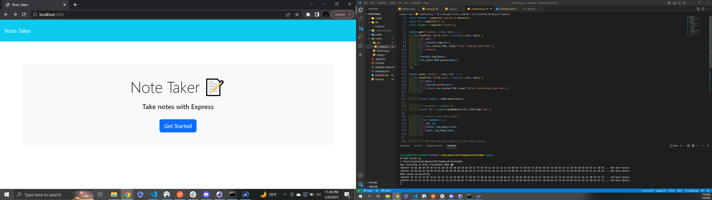
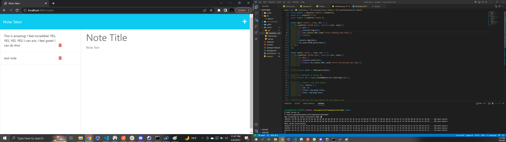

# Notetaker

## This is the Challenge for Module 9
-I was provided the front-end code by my bootcamp, and built the back-end of the application to functionally take down a user's notes.

## Installation
-N/A

## Usage

https://drive.google.com/file/d/11fk1EjRx34tVIR5fY6_so-zrcsFIDOKJ/view

## Credits
-Starter code provided by UCF-FSF-FT-03-2023 repo. I was assisted by a conglomerate effort of my peers on the fundamentals to achieve this challenge's demands, and further assisted by UCF BCS tutor Sachin Jhaveri when troubleshooting functionality.
